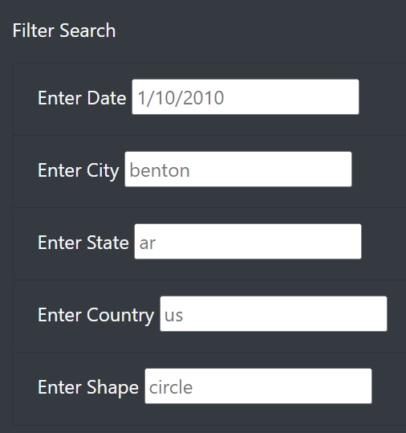

# UFO-Sightings

## Overview
The purpose of this assignment was to create a web page that displays a table of data on UFO sightings, then write code that allows the table to be filtered based on a couple criteria.

## Results
One could use this webpage by typing into the search boxes. 

Each input entered into a search box will filter the table and display the desired results.

## Summary
I personally don't see anything currently wrong with the design; everything functions as intended and relevant data is displayed. The only thing that would make the site more useful is a lot more data.
